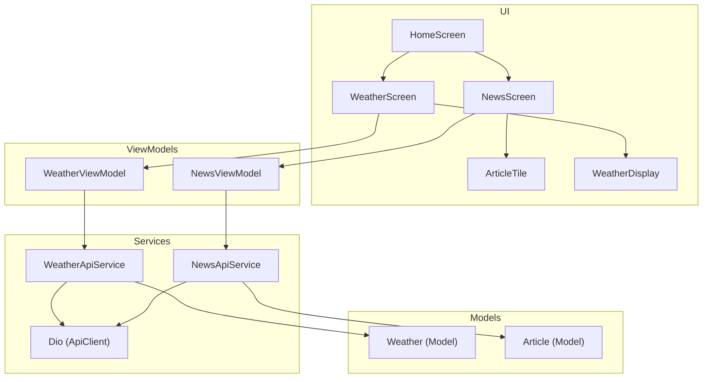
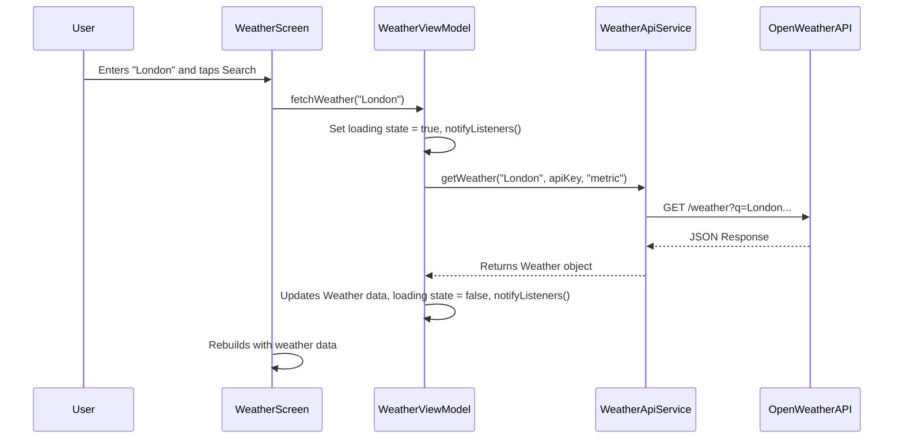

# DESIGN.md for APIConnectApp

## Overview

APIConnectApp will be a Flutter application that demonstrates how to connect to online REST APIs, parse JSON data, and display it in a user-friendly interface. The app will feature both weather and news information, showcasing real-time data retrieval from the internet. It will be built following modern Flutter best practices, including a clear separation of concerns, reactive state management, and a clean, maintainable codebase.

## Detailed Analysis

### Goal

The primary goal is to create a simple yet functional application that serves as a practical example of consuming REST APIs in a Flutter app. The app will:
1.  Fetch weather data for a user-specified location.
2.  Fetch a list of current news headlines.
3.  Use the Retrofit package for type-safe HTTP requests.
4.  Use the `json_serializable` package for efficient JSON parsing.
5.  Use the Provider package for state management.
6.  Display the data in a clear and organized manner.

### User Interface

The app will have a simple tab-based navigation structure.
*   **Main Screen:** A `Scaffold` with a `BottomNavigationBar` to switch between the "Weather" and "News" sections.
*   **Weather Tab:** An input field for the user to enter a city name, a button to trigger the search, and a display area for the current weather conditions (temperature, condition, location).
*   **News Tab:** A scrollable list of news articles, with each item showing the headline and a brief description.

## Alternatives Considered

### HTTP Client

*   **`http` package:** A basic, low-level HTTP client. It's simple to use for one-off requests but lacks features like interceptors, base URL configuration, and automatic request/response parsing, which are beneficial for an app with multiple API calls.
*   **`dio` package:** A powerful and popular HTTP client that Retrofit is built upon. It offers a rich feature set including interceptors, FormData, request cancellation, and more. While we could use `dio` directly, Retrofit provides a higher-level, declarative, and type-safe abstraction over it, which reduces boilerplate code for defining API endpoints.
*   **`retrofit` package:** The user requested this package. It generates the necessary code for making API requests based on an abstract class definition, leading to cleaner and more maintainable API service layers. This is the chosen approach.

### State Management

*   **BLoC (Business Logic Component):** A powerful pattern that separates business logic from the UI. It's excellent for complex applications but can introduce significant boilerplate for a simple app like this.
*   **Riverpod:** A modern and flexible state management solution that addresses some of the limitations of Provider. It's a strong contender, but for simplicity and adherence to the "Flutter Favorites," Provider is a more straightforward choice for this project's scope.
*   **Provider with `ChangeNotifier`:** This approach is simple, easy to understand, and part of the "Flutter Favorites" packages. It allows for a clear separation of UI and business logic without excessive boilerplate. ViewModels will extend `ChangeNotifier` and notify the UI of any data changes. This is the chosen approach.

## Detailed Design

### Project Structure

```
lib/
├── main.dart                 # App entry point, MaterialApp, Provider setup
├── models/
│   ├── article.dart            # Data model for a news article
│   └── weather.dart            # Data model for weather data
├── screens/
│   ├── home_screen.dart        # Main screen with BottomNavigationBar
│   ├── news_screen.dart        # UI for the news list
│   └── weather_screen.dart     # UI for the weather display
├── services/
│   ├── api_client.dart         # Retrofit client setup and instance
│   ├── news_api_service.dart   # Retrofit service definition for News API
│   └── weather_api_service.dart# Retrofit service definition for Weather API
├── viewmodels/
│   ├── news_viewmodel.dart     # ChangeNotifier for news data and logic
│   └── weather_viewmodel.dart  # ChangeNotifier for weather data and logic
└── widgets/
    ├── article_tile.dart       # A reusable widget for a single news article
    └── weather_display.dart    # A reusable widget to show weather info
```

### API Selection

*   **Weather:** [OpenWeatherMap API](https://openweathermap.org/api) will be used. It provides a free tier with access to current weather data. An API key is required.
*   **News:** [NewsAPI.org](https://newsapi.org/) will be used. It offers a free developer plan for accessing top headlines from various sources. An API key is required.

**Note:** For this project, the API keys will be stored as constants. In a production app, they should be stored securely using a mechanism like `flutter_dotenv` or passed via CI/CD environment variables.

### Data Models (with `json_serializable`)

The models will be created in the `lib/models/` directory. They will include `fromJson` and `toJson` methods generated by `json_serializable`.

**`weather.dart`**
```dart
@JsonSerializable()
class Weather {
  final String locationName;
  final double temperature;
  final String condition;

  // constructor, fromJson, toJson
}
```

**`article.dart`**
```dart
@JsonSerializable()
class Article {
  final String title;
  final String? description;
  final String? urlToImage;

  // constructor, fromJson, toJson
}
```

### API Services (with `retrofit`)

An abstract class for each API service will be defined. `build_runner` will generate the implementation.

**`weather_api_service.dart`**
```dart
@RestApi(baseUrl: "https://api.openweathermap.org/data/2.5")
abstract class WeatherApiService {
  factory WeatherApiService(Dio dio, {String baseUrl}) = _WeatherApiService;

  @GET("/weather")
  Future<Weather> getWeather(
    @Query("q") String cityName,
    @Query("appid") String apiKey,
    @Query("units") String units,
  );
}
```

**`news_api_service.dart`**
```dart
@RestApi(baseUrl: "https://newsapi.org/v2")
abstract class NewsApiService {
  factory NewsApiService(Dio dio, {String baseUrl}) = _NewsApiService;

  @GET("/top-headlines")
  Future<NewsResponse> getTopHeadlines(
    @Query("country") String country,
    @Query:("apiKey") String apiKey,
  );
}

// Helper class for parsing the nested response
@JsonSerializable()
class NewsResponse {
  final List<Article> articles;
  // ...
}
```

### ViewModels (with `ChangeNotifier`)

These classes will contain the business logic to fetch and store the data.

**`weather_viewmodel.dart`**
```dart
class WeatherViewModel extends ChangeNotifier {
  Weather? _weather;
  Weather? get weather => _weather;

  bool _isLoading = false;
  bool get isLoading => _isLoading;

  Future<void> fetchWeather(String city) async {
    // set loading state
    // call WeatherApiService
    // update _weather
    // notify listeners
  }
}
```

**`news_viewmodel.dart`**
```dart
class NewsViewModel extends ChangeNotifier {
  List<Article> _articles = [];
  List<Article> get articles => _articles;

  bool _isLoading = false;
  bool get isLoading => _isLoading;

  Future<void> fetchNews() async {
    // set loading state
    // call NewsApiService
    // update _articles
    // notify listeners
  }
}
```

### Diagrams

#### Component Diagram



#### Data Flow Sequence Diagram



## Summary

The proposed design establishes a scalable and maintainable architecture for the APIConnectApp. By using Retrofit for type-safe API calls, `json_serializable` for data parsing, and Provider for state management, the app will be robust and easy to extend. The clear separation of concerns between the UI (Screens/Widgets), business logic (ViewModels), data services (Services), and data structures (Models) will make the codebase clean and understandable.

## References

*   **OpenWeatherMap API:** https://openweathermap.org/api
*   **NewsAPI.org:** https://newsapi.org/
*   **Retrofit for Dart:** https://pub.dev/packages/retrofit
*   **json_serializable:** https://pub.dev/packages/json_serializable
*   **Provider Package:** https://pub.dev/packages/provider
